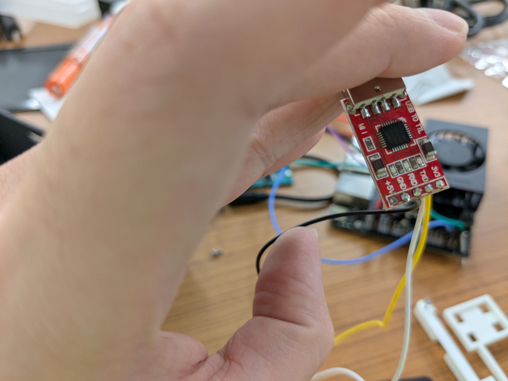

# User Manual

<div>
  
  <div align="center">
    1. Power On Device
  </div>
  <br/> <br/>
  
  <div align="center">
     2. Select Language and Confirm   
  </div>
  <br/> <br/>
  
  <div align="center">
    3. Speak to Translate
  </div>
  <br/> <br/>
  
  <div align="center">
     4. Option to Return to Language Selection
   </div>
</div>


# Technical Manual

The following contains the technical documentation for the various
software and hardware parts of the project. The following sections are
present:
1. [Pipeline](#pipeline)
2. [Fine-tuning](#fine-tuning)
3. [Bill of Materials](#bill-of-materials)
3. [Audio Board](#audio-board)
4. [Audio Board Setup](#audio-board-setup)
4. [3D Files](#3d-files)
4. [Hardware Assembly](#hardware-assembly)

|Folder|Contents|
|---|---|
| 3D Files | 3D CAD and print files for hardware components |
| Audio\_board| Printed Circuit Board (PCB) related files |
| CrowPanel_ESP32_7.0 | Files for developing Screen UI, flashed to the CrowPanel ESP32 Screen |
| speech-translation-pipeline | The source code for the AI model pipeline |
| SquarelineStudioUI | Files for developing Screen UI, layout design in Squareline Studio 1.4.2 |

## Pipeline

###  Installation

To be able to build and run the model pipeline, first a Jetson device
must be set up with Docker, CUDA and Jetpack SDK installed. The only
Jetpack version tested is 6.2, but others should work as well. Once the
device is setup the following needs to be done on the device:

```bash
# Setup docker build system
git clone https://github.com/dusty-nv/jetson-containers ~/jetson-containers
~/jetson-containers/install.sh

# Setup the code repositories

# requires authentication to clone
git clone https://github.com/Lutetium-Vanadium/speech-translation-pipeline ~/speech-translation-pipeline 
# must be cloned in the same directory as speech-translation-pipeline (in this case we use the home directory)
git clone https://github.com/Lutetium-Vanadium/WhisperS2T ~/whisper_s2t

# Fix for docker build system failing because it uses the wrong runtime to build the project
echo '{
	"runtimes": {
    	"nvidia": {
        	"args": [],
        	"path": "nvidia-container-runtime"
    	}
	},
	"default-runtime": "nvidia"
}' | sudo tee /etc/docker/daemon.json
```

Furthermore, `./audio.py` will need to be modified to get use the correct
device and format for the speaker and microphone.

Additionally, all the `run_*` scripts uses a hard-coded path to allow
running it from any user (required if running as daemon for the device
deployment). Before using any of those scripts, please modify the path
to match what is expected.

A single directory containing data, models and any files that need to be
persisted is mounted as a volume to the docker container. By default
this is the `~/cache` directory, but can be changed in the various
`run_*` files. The following the expected structure of the volume:
```
├── data                                                | Extracted data
│   ├── conversation
│   └── reduced-fleurs
├── models
│   ├── models--segment-any-text--sat-3l-sm             | Sentence segmentation, should be auto generated when run
│   ├── nllb
│   │   └── models--facebook--nllb-200-distilled-600M   | NLLB tokenizer, should be auto-generated when run
│   ├── nllb-ctranslate                                 | Location for CTranslate2 nllb checkpoint
│   │   ├── config.json
│   │   ├── model.bin
│   │   └── shared_vocabulary.json
│   ├── silero-vad                                      | Location for voice activity detector
│   │   └── model.onnx
│   ├── tiny                                            | Word alignment model, should be auto-generated
│   │   ├── config.json
│   │   ├── model.bin
│   │   ├── tokenizer.json
│   │   └── vocabulary.txt
│   ├── tts                                             | All the TTS models
│   │   ├── mms-tts-eng
│   │   ├── mms-tts-hin
│   │   ├── mms-tts-ind
│   │   ├── mms-tts-tgl
│   │   ├── mms-tts-tha
│   │   ├── mms-tts-vieTODO
│   │   ├── mms-tts-zlm
│   │   └── vits-cmn
│   ├── whisper_turbo                                   | Default location for whisper with
│   └── whisper_turbo_weights                           | TensorRT-LLM
└── results                                             | Test results stored here
    ├── conversation
    ├── fleurs
    └── latency
```

All the non auto-generated models can be downloaded from [here](https://huggingface.co/lutetium-vanadium/s2t-pipeline-models)

If you expect to require converting a fine-tuned Whisper checkpoint to
use `TensorRT`, then it is recommended to apply the first fix mentioned
in the [troubleshooting section](#troubleshooting).

### Building

To build the pipeline, run the following:
```bash
./build.sh
```
If you encounter any issue with the build system, check the
[troubleshooting section](#troubleshooting) for any known issues.

In order to convert Whisper model checkpoints, you can modify the
environment variables defined in `./whisper-conversion/convert_trt.sh`
to what you require and run it. Note that the source directory must
contain two files: a copy of `./whisper-conversion/mel_filters.npz` and
`{model}.pt` (a single checkpoint file) where `model` is the name of
the model.

To convert NLLB-200 checkpoints, run the following:
```bash
ct2-transformers-converter \
  --model path/to/transformers/checkpoint \
  --output_dir path/to/models/nllb-ctranslate/ \
  --quantization float16
```

### Running

There are 3 available bash scripts to run the model docker container. 
- `./run_shell.sh` - runs the pipeline expecting the UART screen to be
  available at `/dev/ttyUSB0`.
- `./run_no_screen.sh` - runs the pipeline without making the UART
  screen available to the pipeline.t
- `./run.sh` - same as `run_shell.sh` without an attached interactive
  TTY (see [running on boot](#run-on-boot)).

These by default just execute a bash shell, however, if you pass arguments
to the run script, the arguments will be interpreted as a command and be
executed instead.

The model pipeline can be ran by running the `main.py` file. It has the
following important arguments.
```
usage: main.py [-h] [--file FILE] [--min-chunk-size MIN_CHUNK_SIZE]
               [--model_dir MODEL_DIR]
               [--backend {faster-whisper,whisper_timestamped,mlx-whisper,openai-api,whisper-s2t}]
               [--vac] [--vac-chunk-size VAC_CHUNK_SIZE]
               [-l {DEBUG,INFO,WARNING,ERROR,CRITICAL}] [--prob PROB]

options:
  -h, --help            show this help message and exit
  --file FILE           Filename of 16kHz mono channel wav, on which live
                        streaming is simulated. If not specified the mic
                        is used.
  --min-chunk-size MIN_CHUNK_SIZE (default 1.0)
                        Minimum audio chunk size in seconds. It waits up to
                        this time to do processing. If the processing takes
                        shorter time, it waits, otherwise it processes the
                        whole segment that was received by this time.
  --model_dir MODEL_DIR (default: /model-cache/models/whisper_turbo)
                        Dir where Whisper model and other files are saved.
  --backend {faster-whisper,whisper-s2t}
                        (default: whisper-s2t)
                        Load only this backend for Whisper processing.
                        whisper-s2t is the TensorRT-LLM based Whisper.
  --vac                 Use VAC = voice activity controller. Recommended.
  --vac-chunk-size VAC_CHUNK_SIZE (default: 0.04)
                        VAC sample size in seconds.
  -l, --log-level {DEBUG,INFO,WARNING,ERROR,CRITICAL} (default: DEBUG)
                        Set the log level
  --prob PROB           (default: 0.4) Set the language probabilty threshold.
```

### Run on boot

If you want to run the pipeline as on boot (required during device
deployment), then the following changes need to be made.

- Apply `./jetson-fixes/daemon-run.patch` so that the docker image can
  run without expecting an interactive TTY attached.

- Setup the `systemd` service file for the pipeline in `/etc/systemd/system/pipeline.service`:
  ```
  [Unit]
  Description="Run pipeline on boot"

  [Service]
  ExecStart=/path/to/speech-translation-pipeline/run_on_boot.sh

  [Install]
  WantedBy=multi-user.target
  ```
- Finally, enable the service:
  ```bash
  sudo systemctl enable pipeline.service
  ```

### Code Structure

- `./main.py` is the entrypoint which contains the linking code to join
  all the models into a single pipeline, and connect the models to the
  hardware.
- `./asr` contains the code for the transcription model (Whisper).
- `./mt` contains the code for the translation model (NLLB-200).
- `./tts` contains the code for the speech-to-text model (MMT-TTS/VITS).
- `./audio.py` interfaces with the speaker and mic.
- `./ui.py` interfaces with the screen over UART.
- `./common.py` contains some common utilities and constants.
- `./test_*` contains the test cases (see [tests](#tests))

### Tests

There are 3 tests:
- `test_fleurs.py` runs the tests on the [reduced-fleurs dataset](https://huggingface.co/datasets/lutetium-vanadium/s2t-test-datasets/resolve/main/reduced-fleurs.tar.gz?download=true), measure the accuracy metrics.
- `test_conversation.py` runs the tests on the [conversation dataset](https://huggingface.co/datasets/lutetium-vanadium/s2t-test-datasets/resolve/main/conversation.tar.gz?download=true), measure the accuracy metrics.
- `test_latency.py` runs the tests on the [reduced-fleurs dataset](https://huggingface.co/datasets/lutetium-vanadium/s2t-test-datasets/resolve/main/reduced-fleurs.tar.gz?download=true), measuring the various latency metrics.

> Before running the tests, make sure to download and extract the data
> to the appropriate location in the mounted volume.

### Troubleshooting

Due to strict versioning and environment requirements, throughout the
projects multiple build issues arose periodically, sometimes with no
change to the codebase. Some of these required applying patches to the
`jetson-containers` install on the Jetson. It is recommended you try
building and apply the patches only if you face an issue.

- If you require to convert a Whisper checkpoint`TensorRT-LLM`, then
  copy `./jetson-fixes/tensorrt_llm-source.tar.gz` to
  `jetson-containers/packages/llm/tensorrt_optimizer/tensorrt_llm/sources/source.tar.gz`.
  This contains necessary changes to the conversion scripts to support
  `whisper-turbo`.
  > Note this is stored as a [Git LFS](https://git-lfs.com/) file, so if you need you will need
  > to either manually download it or install git lfs and pull it.
- If `TensorRT-LLM` fails to build because it cannot install
  `diffusers`, then apply `./jetson-fixes/tensorrt-diffusers.patch`.
- If the test phase of `transformers` fails, then apply `./jetson-fixes/transformers.patch`.
- If Whisper gives the following issue, then apply `./jetson-fixes/whisper.patch`.
  ```
  TypeError: scaled_dot_product_attention(): argument 'is_causal' must be bool, not Tensor
  ```

## Fine-tuning

TODO

## Bill of Materials
TODO
| Index | ITEMS (HARDWARE) | Quantity  | Cost per unit | Link from Vendor  | Remark | Cost |
| :---- | :---- | :---- | :---- | :---- | :---- | :---- |
| 1 | 20\*14mm Ultra-thin Side-emitting Cavity Speaker 8ohm 0.5-2W | 1 | $2.23 | https://www.aliexpress.com/item/1005004431389186.html?spm=a2g0o.detail.pcDetailTopMoreOtherSeller.6.2004QljoQljocJ\&gps-id=pcDetailTopMoreOtherSeller\&scm=1007.40050.354490.0\&scm\_id=1007.40050.354490.0\&scm-url=1007.40050.354490.0\&pvid=fde48253-9934-41ff-94c3-c49ce7e34490&\_t=gps-id:pcDetailTopMoreOtherSeller,scm-url:1007.40050.354490.0,pvid:fde48253-9934-41ff-94c3-c49ce7e34490,tpp\_buckets:668%232846%238115%232000\&pdp\_npi=4%40dis%21SGD%214.93%212.23%21%21%213.65%211.65%21%402141122217291864546591855e890c%2112000029161744393%21rec%21SG%21%21ABXZ\&utparam-url=scene%3ApcDetailTopMoreOtherSeller%7Cquery\_from%3A |  | 2.23 |
| 2 | 4010 12v/24v cooler cooling fan blower 2 Pin | 1 | $5.80 | https://www.aliexpress.com/item/4001080434013.html?spm=a2g0o.productlist.main.15.7e6158beJfPWS8\&algo\_pvid=c33ebe12-994a-48ae-bfdf-bd27688ac8eb\&aem\_p4p\_detail=202410172202401243022510771160004269754\&algo\_exp\_id=c33ebe12-994a-48ae-bfdf-bd27688ac8eb-7\&pdp\_npi=4%40dis%21SGD%218.69%216.78%21%21%216.42%215.01%21%4021015c7617292277600205696e84ac%2112000017755013245%21sea%21SG%210%21ABX\&curPageLogUid=NQtyeIUac71O\&utparam-url=scene%3Asearch%7Cquery\_from%3A\&search\_p4p\_id=202410172202401243022510771160004269754\_2\#nav-specification |  | 5.8 |
| 3 | 40\*40\*11mm Heatsink | 1 | $1.54 | https://www.aliexpress.com/item/1005006407762017.html?spm=a2g0o.productlist.main.93.64604efaAWHNDd\&algo\_pvid=d618a318-4ca2-4eb6-a180-d338d744fda0\&algo\_exp\_id=d618a318-4ca2-4eb6-a180-d338d744fda0-46\&pdp\_npi=4%40dis%21SGD%211.54%211.54%21%21%218.10%218.10%21%4021015c7617292740744866628e5619%2112000037056456372%21sea%21SG%210%21ABX\&curPageLogUid=pkaLW8fed8Zr\&utparam-url=scene%3Asearch%7Cquery\_from%3A |  | 1.54 |
| 4 | 4TB SSD | 1 | $331.00 | https://www.lazada.sg/products/crucial-p3-plus-pcie-40-3d-nand-nvme-m2-ssd-ctxxxp3pssd8-i2443341715-s14474320975.html? | Storage for training data | 331 |
| 5 | CrowPanel 7.0" \-HMI ESP32 Display | 1 | $45.55 | https://www.elecrow.com/esp32-display-7-inch-hmi-display-rgb-tft-lcd-touch-screen-support-lvgl.html |  | 45.55 |
| 6 | 22 AWG wire | 1 | $11.05 | https://www.aliexpress.com/item/1005005888991575.html?spm=a2g0o.productlist.main.1.6cec9Nsx9NsxPG\&algo\_pvid=adf87429-8ac6-4411-beb8-70eeec7d3cfb\&algo\_exp\_id=adf87429-8ac6-4411-beb8-70eeec7d3cfb-0\&pdp\_ext\_f=%7B%22order%22%3A%223309%22%2C%22eval%22%3A%221%22%7D\&pdp\_npi=4%40dis%21SGD%216.32%216.32%21%21%2134.10%2134.10%21%40213bd97f17447231845696173e7826%2112000034717501746%21sea%21SG%216069331024%21X\&curPageLogUid=6Fhvjvwl9Nms\&utparam-url=scene%3Asearch%7Cquery\_from%3A |  | 11.05 |
| 7 | CP2102 USB to UART | 1 | $11.99 | https://askelectronic.com/ | Purchased from physical store | 11.99 |
| 8 | M2 Screws 4mm-20mm | 1 | $13.61 | https://www.aliexpress.com/item/4001072025844.html?spm=a2g0o.order\_detail.order\_detail\_item.4.5a9df19cvMea0Q |  | 13.61 |
| 9 | Kapton tape | 1 | $4.50 | https://www.aliexpress.com/item/1005007518587827.html?spm=a2g0o.order\_detail.order\_detail\_item.4.6bc7f19cbkQg5K |  | 4.5 |
| 10 | Jetson Orin NX 16GB | 1 | $1,396.98 | https://sg.element14.com/seeed-studio/110110145/recomputer-j4012-edge-ai-device/dp/4200148 |  | 1396.98 |
| 11 | BMS 60A Balanced | 1 | $3.86 | https://www.aliexpress.com/item/1005006906778570.html?spm=a2g0o.order\_list.order\_list\_main.23.65891802ZWjo3r |  | 3.86 |
| 12 | CC/CV Buck Converter | 1 | $6.12 | https://www.aliexpress.com/item/1005006700914240.html?spm=a2g0o.order\_list.order\_list\_main.41.65891802ZWjo3r |  | 6.12 |
| 13 | USB-C trigger | 1 | $3.05 | https://www.aliexpress.com/item/1005007889747084.html?spm=a2g0o.order\_list.order\_list\_main.40.65891802ZWjo3r |  | 3.05 |
| 14 | pcb mic/speaker | 1 | $169.00 | NIL | Refer to Audio | 169 |
| 15 | batteries 21700 | 1 | $41.44 | https://shopee.sg/Samsung-50S-21700-5000mah-25A-3.7V-Li-ion-Rechargeable-Cell-i.607079901.23414128175 |  | 41.44 |
| 16 | mini dc step down | 1 | $14.59 | https://shopee.sg/DC-DC-Step-Down-Buck-Converter-3.3V-5V-12V-(3A)-i.440521573.23246695217?xptdk=8e8f4b62-ad5d-45b9-bc19-ad9114e600b8 |  | 14.59 |
| 17 | USB-C short angled cable | 1 | $10.89 | https://shopee.sg/L-Shape-USB-Type-C-Cable-90-Degree-Fast-Charge-Data-60W-PD-4.0-Short-Cable-for-Mobile-Tablet-Laptop-Mac-i.804140.12996128561?xptdk=22711e09-5882-46c8-a854-b30f56242955 |  | 10.89 |
| 18 | 12V DC Rocker Switch | 1 | $3.00 | https://continental.sg/ | Purchased from physical store | 3 |
| 19 | XT30 Connectors Male+ Female | 4 | $1.00 | https://continental.sg/ | Purchased from physical store | 4 |
| 20 | PETG-CF | 1 | $42.13 | https://asia.store.bambulab.com/products/petg-cf |  | 42.13 |
| 21 | PLA | 1 | $30.27 | https://asia.store.bambulab.com/products/pla-matte |  | 30.27 |
|  | Estimated Total  |  | $2,152.60 |  |  |  |

## Audio Board 

The Printed Circuit Board (PCB) related files are stored in the folder ***Audio\_board.*** 

| File/Folder Name  | Description  |
| :---- | :---- |
| Gerber  | Contains all files required for PCB manufacturing  |
| Capstone\_layout | PCB layout  |
| Capstone\_schematic  | PCB schematic |
| bom  | Contains interactive bill of materials (bom) plugin  |
| noise\_cancellation  | Contains python code for noise cancellation that has not been fully tested and deployed |

The current schematic and layout used for manufacturing underwent 2 real-life modifications prior to deployment on the prototype. 

1) Addition of a Schottky diode between the VOUT of the voltage regulator and VCCI (pin 10\) of the USB codec (PCM2902), which was necessary to prevent potential backfeeding and ensure proper voltage regulation.   
2) Before the PCB was designed, the microphone amplifier circuit was tested using a different ADC codec. During those initial tests, it was observed that the output volume was too high, introducing excessive noise. To address this, a voltage divider was added across the amplifier output to reduce the gain. However, in the final PCB design, a different codec was used, which resulted in significantly lower input sensitivity. As a result, resistor R7 from the voltage divider was removed to restore the gain. If further gain increase is required, the PCB allows for modification by cutting specific traces and leaving the gain pin on the MAX9814 microphone amplifier floating, which sets the gain to its maximum of 60dB. 

### Audio Board Setup

![][image1]

1. Connect the pins to the Jetson 40 Pin Header:

   Pin 1 → Ground 

   Pin 2 → 5V

   Pin 3→ I2s\_FS (pin 35 on Orin Nx/ Nano development kit)

   Pin 4→I2S\_SCLK (pin 12 on Orin Nx/ Nano development  kit)

   Pin 5 → DOUT (pin 40 on Orin Nx/ Nano development  kit) 

   I2s\_FS (pin 35 on Orin Nx/ Nano development  kit)


2. Connect the PCB’s USB-C port to the Jetson’s development kit USB type C or type A port using a cable

   ![][image2]

3. Navigate to the Jetson Expansion Header Tool by running the command `$ sudo /opt/nvidia/jetson-io/jetson-io.py`

   ![][image3]

4. Select 'Configure Jetson for compatible hardware,' then assign the I2S function to the appropriate pins.
   
5. Save and reboot

### Audio System Modification Based on existing hardware for Enhanced Functionality

To further develop the audio board based on the current hardware, consider replacing the existing I²S Class D audio amplifier with an alternative amplifier that can be more easily integrated with the existing PCM2902 ADC codec. The PCM2902 offers built-in volume and mute controls via its Human Interface Device (HID) function, hence a rotary encoder could also be added for volume control. 

More importantly, integrating such a USB audio codec could enable audio loopback functionality, which is essential for implementing echo cancellation algorithms—an important feature for improving audio clarity in real-time communication scenarios.​

[image1]: audioimages/image1.png

[image2]: audioimages/image2.png

[image3]: audioimages/image3.png

## 3D Files
| Name | Filename | Description |
| :---- | :---- | :---- |
| FormFactor Tablet V6 Fusion | FormFactor\_Tablet\_V6.f3z | Fusion360 file for main prototype design |
| FormFactor Tablet V6 Step | FormFactor\_Tablet\_V6.step | STEP file for main prototype design |
| Bezel | Bezel.stl | STL file for the bezel 3D print (PETG) |
| BackStock | BackStock.stl | STL file for the back 3D print for stock cooling solution (PETG) |
| BackCustom | BackCustom.stl | STL file for the back 3D print for custom cooling solution (PETG) |
| JetsonHolder | JetsonHolder.stl | STL file for the JetsonHolder 3D print (PLA/PETG) |
| BatteryHolder | BatteryHolder.stl | STL file for the BatteryHolder 3D print (PLA/PETG) |

## Hardware Assembly
### Component Assembly
The following section describes several components which require preparation or midification before proceeding with the final assembly.
#### Switch Wiring

Solder ~20cm of wire to 2 XT30 female connectors, with the ends connected to the switch as shown. Apply heatshrink over exposed metal contacts. Label the XT30 connector with only one terminal SW1, and the XT30 connector with two terminals SW2, as shown.

#### Connector Wiring

Solder an XT30 connector to the output of the mini buck converter using ~5cm of wire.


Solder the remaining connections as shown in the two images above. The ground wire is connected to the mini buck converter's input, the DC barrel jack, the fan, the XT30 female connector labelled BAT, and the XT30 male connector labelled SW2.

Solder the 12V connection between the male XT30 connector labelled SW2 and the female XT30 connector labelled SW2.

Solder together a 12V wire between the mini buck converter's input, the DC barrel jack, the fan, and the XT30 male connector labelled SW1.
These various connections use approximately ~5-10cm of wire.

Solder the output terminals of the mini buck converter to ~5cm of wire, terminating in an XT30 female connector, labelled ESP.

Apply heatshrink over exposed metal contacts.

#### Battery holder/wiring

Solder the discharge pads on the BMS to ~15-20cm of wire, connected to an XT30 male connector labelled BAT.


Solder the batteries in a 3S configuration (connect positive terminal to negative terminal). Solder the 0V, 4.2V, 8.4V, and 12.6V pads to their respective battery terminals as shown. Use ~10-20cm of wire for the pads on the left (0V, 8.4V, charge positive, charge ground), and ~25-40cm of wire for the pads on the right (4.2V, 12.6V).

Apply kapton tape on the exposed terminals and fit into battery holder as shown. Fit the buck converter into the battery holder as shown. Wrap ~1cm thick kapton tape around the batteries through the slot in the battery holder.


Solder the charge terminals to ~20cm of wire. Solder the positive wire to the Schottky diode. Screw the positive and ground wires into the respective screw terminals on the buck converter's output terminals.


Solder the USB-C trigger output terminals to ~15cm of wire, and screw the wires into the respective screw terminals on the buck converter's input terminals.

#### Screen modification

Remove the GPIO_D and I2C headers on the screen.


Remove the BAT header on the screen. Solder ~5cm of wire connected to an XT30 male connector labelled ESP.


Remove the USB-UART module header pins. Solder ~20cm of wire to the GND, RXD, and TXD pins as shown.


Crimp the other wire ends into a 4-pin grove connector as shown. Connect it to the UART header on the screen.


Completed screen modification.


### Final assembly


Place the screen in the bezel as shown. Screw in a M2 5mm screw into the highlighted hole.


Place the assembled battery holder and jetson holder on the bezel as shown

Screw in M2 12mm screws into the 3 holes highligted in red.

Place the BMS as shown, highlighted in blue. Secure with kapton tape.


Secured batteries and BMS


Place the USB-C trigger as shown. Secure with kapton tape.

Secured USB-C trigger


Insert the mini buck converter as shown. Secure with kapton tape.


Insert the buck converter as shown. Secure with kapton tape.


Secured mini buck converter


Connect the XT30 connectors labelled ESP


Place the audio PCB in the slot as shown in red. Secure with blu-tack adhesive.
Place the speaker in the slot as shown in blue. Screw in M2 5mm screws into the 2 holes the speaker is placed over.


Connect the speaker and USB-C cable to the PCB as shown.


Place the assembled jetson on the jetson holder as shown.
Screw in M2 5mm screws into the 2 holes highlighted in red.
Screw in M2 20mm screws into the 2 holes highlighted in blue.


If using custom cooling solution, place the fan as shown. Screw in M2 5mm screws into the 2 holes the fan is placed over.


Connect the PCB wires to the 40-pin header on the jetson as shown.


Connect the USB-C cable to the jetson as shown.


Connect the USB-UART module to the jetson as shown.


Connect the DC barrel jack to the jetson as shown.


Connect the XT30 connectors labelled BAT.


Place the switch into the back as shown.


Connect the XT30 connectors labelled SW1. Connect the XT30 connectors labelled SW2.


Enclose the device with the back


Screw in M2 6mm screws into the 2 highlighted holes.
